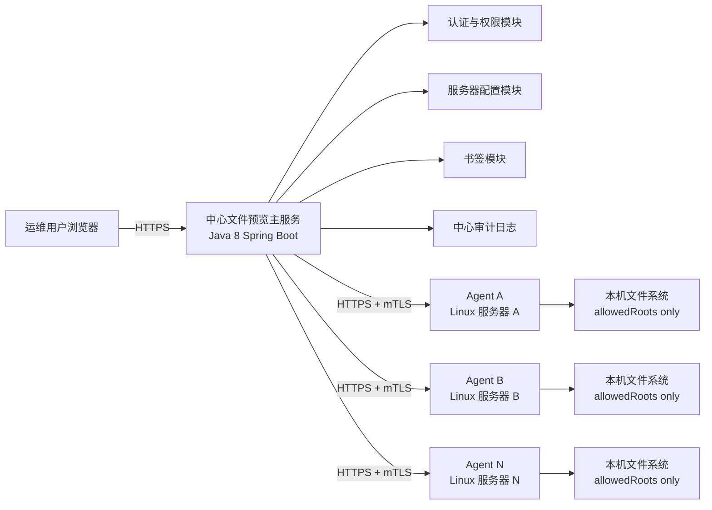

# Linux 服务器文件预览服务需求与技术方案

## 1. 背景

当前运维人员需要分别登录十几台 Linux 服务器，通过终端命令查看目录和文件内容。服务器之间频繁切换时，操作繁琐、体验不直观、审计分散，也不利于统一控制哪些人可以看哪些服务器和哪些路径。

目标是建设一个集中式文件预览服务：用户登录 Web 页面后，可以像 FileZilla、WinSCP 或常见文件管理器一样切换服务器、浏览目录树、查看文件列表、预览文件内容，并为常用路径配置书签。

由于当前服务器访问依赖账号授权平台，主服务可能无法直接拿到各服务器账号密码，也不适合强依赖 SFTP。因此本方案改为：

**中心 Web 主服务 + 每台目标服务器部署轻量 Agent。**

Agent 在目标服务器本机以低权限账号运行，只提供受限只读文件浏览 API。中心主服务通过 mTLS 调用 Agent，前端用户只访问中心主服务。

## 2. 关键约束

1. 中心主服务需要兼容 JDK 1.8。
2. 不保存每台服务器的用户密码。
3. 不依赖 SFTP。
4. 部署资源尽量少，中心主服务优先单 Jar 部署，Agent 优先单文件二进制部署。
5. 每台目标服务器只允许中心主服务服务器访问 Agent 端口。
6. 系统以只读预览为核心，暂不实现上传、删除、改名、编辑、Web 终端、任意命令执行等高风险能力（系统内预留接口）。

## 3. 核心结论

推荐架构：

- 中心主服务：Java 8 + Spring Boot 2.7.x，负责 Web UI、用户认证、权限、服务器配置、书签、审计、请求转发。
- 目标服务器 Agent：Go 静态单文件二进制，负责本机只读文件操作。
- 通信方式：中心主服务通过 HTTPS + mTLS 调用各服务器 Agent。
- 网络控制：目标服务器防火墙或安全组只允许中心主服务 IP 访问 Agent 端口。
- 权限控制：中心主服务做用户级权限判断，Agent 再做服务器本地 allowedRoots、deniedPaths、真实路径校验和只读限制。

为什么 Agent 推荐用 Go：

- 可编译为 Linux 静态单文件，目标服务器不需要安装 JDK、Python、Node 等运行时。
- 内存占用低，启动快，部署简单。
- 可以直接使用系统文件 API 读取目录和文件，避免 shell 命令注入风险。
- mTLS、HTTP Server、文件操作、路径处理都可用标准库或少量成熟库实现。

如果团队强制全 Java 技术栈，也可以将 Agent 做成 Java 8 单 Jar，但每台目标服务器需要具备 JRE/JDK 1.8，资源占用和运维成本会更高。本文主推 Go Agent。

## 4. 总体架构



请求链路：

1. 用户登录中心主服务。
2. 用户选择服务器和路径。
3. 中心主服务检查用户是否有权限访问该服务器和路径。
4. 中心主服务用 mTLS 调用对应服务器 Agent。
5. Agent 校验调用方证书、来源 IP、请求签名、路径策略。
6. Agent 读取本机目录或文件片段，返回 JSON 或文本片段。
7. 中心主服务记录审计并返回给前端展示。

## 5. 技术栈

### 5.1 中心主服务

- JDK 1.8
- Spring Boot 2.7.x
- Spring Security
- Maven
- 嵌入式 Tomcat 或 Undertow
- H2 file mode 或 SQLite JDBC
- Flyway 或 Liquibase
- Logback
- BCrypt
- Apache HttpClient 4.x 或 OkHttp 3.x，需兼容 Java 8 且支持 mTLS
- 前端静态资源打包进 Spring Boot Jar

### 5.2 前端

- React 18
- TypeScript
- Vite
- Ant Design 或 Arco Design
- Monaco Editor
- 构建后资源输出到 `src/main/resources/static`

Node.js 只作为构建期依赖，运行期只需要 JDK 1.8。

### 5.3 目标服务器 Agent

- Go 1.22 或更高版本开发与构建
- 产物为 Linux 静态单文件二进制
- 标准库 HTTP Server + TLS
- 文件操作使用 Go 标准库 `os`、`io`、`path/filepath`
- 配置解析使用 YAML 库
- 日志使用结构化 JSON 日志

Agent 运行期不依赖 Go 环境。

## 6. 部署形态

### 6.1 中心主服务

目录结构：

```text
file-preview-main/
  linux-file-preview.jar
  config/
    application.yml
    servers.yml
    certs/
      main-client.crt
      main-client.key
      agent-ca.crt
  data/
    app.h2.db
  logs/
    app.log
```

启动：

```bash
java -jar linux-file-preview.jar --spring.config.location=./config/application.yml
```

### 6.2 目标服务器 Agent

目录结构：

```text
/opt/file-preview-agent/
  file-preview-agent
  config/
    agent.yml
    certs/
      agent-server.crt
      agent-server.key
      main-ca.crt
  logs/
    agent.log
```

systemd 运行：

```ini
[Unit]
Description=File Preview Agent
After=network.target

[Service]
User=filepreview
Group=filepreview
WorkingDirectory=/opt/file-preview-agent
ExecStart=/opt/file-preview-agent/file-preview-agent --config /opt/file-preview-agent/config/agent.yml
Restart=always
RestartSec=5
NoNewPrivileges=true
PrivateTmp=true

[Install]
WantedBy=multi-user.target
```

Agent 应使用专用低权限用户运行，例如 `filepreview`。需要读取的日志或配置目录通过 Linux 用户组、ACL 或只读权限授予，不建议 Agent 以 root 运行。

## 7. 网络与安全边界

每台目标服务器：

- Agent 监听内网端口，例如 `9443`。
- 防火墙或安全组只允许中心主服务 IP 访问 `9443`。
- Agent 必须启用 HTTPS + mTLS。
- Agent 只信任中心主服务的客户端证书 CA 或指定证书指纹。
- 可选增加请求签名或静态 API Token，作为 mTLS 之外的第二层校验。
- Agent 不对公网开放。

中心主服务：

- 仅对内网、VPN 或办公网关开放。
- 生产环境必须启用 HTTPS。
- 建议通过 Nginx 或统一网关做 TLS、访问日志、IP 限流。

## 8. 权限模型

权限分两层。

第一层在中心主服务：

- 用户是否能看到某台服务器。
- 用户是否能访问某台服务器上的某个根路径。
- 用户是否允许预览、tail、搜索、下载。
- 用户是否能管理全局书签和服务器配置。

第二层在 Agent：

- 请求是否来自合法中心主服务。
- 请求路径是否在 Agent 本地 `allowedRoots` 下。
- 请求路径是否命中 `deniedPaths`。
- 真实路径是否仍在授权目录下。
- 文件类型、大小、读取模式是否符合限制。

这样即使中心主服务配置错误，Agent 仍会在目标服务器本地做最后一道拦截。

## 9. 服务器配置

中心主服务 `servers.yml` 示例：

```yaml
servers:
  - id: prod-app-01
    name: 生产应用 01
    env: prod
    enabled: true
    tags:
      - prod
      - app
    agent:
      baseUrl: https://10.10.1.11:9443
      serverName: prod-app-01-agent
      connectTimeoutMs: 2000
      readTimeoutMs: 10000
      caCertRef: agent-ca
      clientCertRef: main-client
    defaultRoot: /opt/apps
    allowedRoots:
      - /opt/apps
      - /data/logs
    deniedPaths:
      - /etc/shadow
      - /root
      - /home/*/.ssh
      - /proc
      - /sys
      - /dev
    bookmarks:
      - name: 应用日志
        path: /data/logs/app
      - name: 配置目录
        path: /opt/apps/current/config
```

Agent `agent.yml` 示例：

```yaml
serverId: prod-app-01
listen:
  host: 0.0.0.0
  port: 9443

tls:
  certFile: /opt/file-preview-agent/config/certs/agent-server.crt
  keyFile: /opt/file-preview-agent/config/certs/agent-server.key
  clientCaFile: /opt/file-preview-agent/config/certs/main-ca.crt
  allowedClientSubjects:
    - CN=file-preview-main

security:
  allowedSourceCidrs:
    - 10.10.0.5/32
  allowedRoots:
    - /opt/apps
    - /data/logs
  deniedPaths:
    - /etc/shadow
    - /etc/sudoers
    - /root
    - /home/*/.ssh/**
    - /**/id_rsa
    - /**/*.pem
    - /**/*.key
    - /proc
    - /sys
    - /dev
  showHiddenFilesDefault: false
  maxDirectoryEntries: 1000
  maxPreviewBytes: 524288
  maxTailLines: 5000
  maxSearchResults: 200
  requestTimeoutSeconds: 10

logging:
  file: /opt/file-preview-agent/logs/agent.log
```

中心主服务和 Agent 的 `allowedRoots` 建议保持一致，但 Agent 的配置拥有最终拒绝权。

## 10. Agent 内部 API

Agent API 仅供中心主服务调用，不直接暴露给浏览器。

### 10.1 健康检查

```http
GET /agent/v1/health
```

返回：

```json
{
  "serverId": "prod-app-01",
  "status": "UP",
  "version": "1.0.0"
}
```

### 10.2 能力查询

```http
GET /agent/v1/capabilities
```

返回 Agent 支持的预览大小、tail 行数、搜索能力、图片预览能力等。

### 10.3 目录列表

```http
POST /agent/v1/files/list
Content-Type: application/json
```

请求：

```json
{
  "requestId": "uuid",
  "user": {
    "id": "u001",
    "name": "zhangsan"
  },
  "path": "/data/logs",
  "options": {
    "showHidden": false,
    "sortBy": "name",
    "sortOrder": "asc",
    "offset": 0,
    "limit": 200
  }
}
```

响应：

```json
{
  "path": "/data/logs",
  "realPath": "/data/logs",
  "entries": [
    {
      "name": "app.log",
      "path": "/data/logs/app.log",
      "type": "file",
      "size": 123456,
      "mode": "-rw-r-----",
      "owner": "app",
      "group": "app",
      "modifiedAt": "2026-07-18T10:00:00+08:00",
      "readable": true,
      "previewable": true
    }
  ],
  "hasMore": false
}
```

### 10.4 文件元信息

```http
POST /agent/v1/files/meta
```

请求包含 `requestId`、`user`、`path`。

### 10.5 文件预览

```http
POST /agent/v1/files/preview
```

请求：

```json
{
  "requestId": "uuid",
  "user": {
    "id": "u001",
    "name": "zhangsan"
  },
  "path": "/data/logs/app.log",
  "options": {
    "mode": "head",
    "offset": 0,
    "limitBytes": 524288,
    "encoding": "UTF-8"
  }
}
```

响应：

```json
{
  "path": "/data/logs/app.log",
  "realPath": "/data/logs/app.log",
  "mimeType": "text/plain",
  "encoding": "UTF-8",
  "size": 12345678,
  "truncated": true,
  "contentBase64": "..."
}
```

说明：Agent 可以返回 base64 内容，避免不同编码和二进制内容破坏 JSON。中心主服务负责按用户选择的编码解码并传给前端。

### 10.6 日志 tail

```http
POST /agent/v1/files/tail
```

支持按行读取尾部内容，默认 500 行，最大值由 Agent 配置控制。

### 10.7 文件搜索

```http
POST /agent/v1/files/search
```

MVP 可暂缓实现。若实现，Agent 不应调用用户可控 shell 命令，优先使用 Go 逐行扫描，并设置最大读取字节数、最大返回行数、超时。

## 11. 中心主服务对前端 API

### 11.1 认证

```http
POST /api/auth/login
POST /api/auth/logout
GET  /api/auth/me
```

### 11.2 服务器

```http
GET /api/servers
GET /api/servers/{serverId}
GET /api/servers/{serverId}/roots
GET /api/servers/{serverId}/health
```

### 11.3 文件

```http
GET /api/servers/{serverId}/files?path=/data/logs
GET /api/servers/{serverId}/files/meta?path=/data/logs/app.log
GET /api/servers/{serverId}/files/preview?path=/data/logs/app.log&mode=head&limitBytes=524288&encoding=UTF-8
GET /api/servers/{serverId}/files/tail?path=/data/logs/app.log&lines=500&encoding=UTF-8
GET /api/servers/{serverId}/files/search?path=/data/logs/app.log&q=ERROR&maxLines=200
```

### 11.4 书签

```http
GET    /api/bookmarks
POST   /api/bookmarks
PUT    /api/bookmarks/{id}
DELETE /api/bookmarks/{id}
```

### 11.5 审计

```http
GET /api/admin/audits
GET /api/admin/audits/export
```

## 12. 功能需求

### 12.1 登录与用户权限

MVP 支持本地用户登录，后续支持 OIDC、LDAP 或企业统一认证。

角色：

- `ADMIN`：管理服务器配置、用户、全局书签、权限规则、证书配置。
- `OPERATOR`：查看被授权服务器和路径，管理个人书签。
- `AUDITOR`：查看审计日志，不访问文件内容。

权限维度：

- 用户或用户组可访问的服务器。
- 用户或用户组可访问的根路径。
- 是否允许预览。
- 是否允许 tail。
- 是否允许搜索。
- 是否允许下载。
- 是否允许查看隐藏文件。

### 12.2 服务器管理

MVP 通过 `servers.yml` 管理服务器。后续可扩展为管理页面。

服务器列表支持：

- 按环境筛选。
- 按标签筛选。
- 按名称、IP、服务器 ID 搜索。
- 显示 Agent 在线状态。
- 显示 Agent 版本。
- 显示最近访问时间。

### 12.3 书签

书签类型：

- 全局书签：管理员配置，所有有权限用户可见。
- 团队书签：指定用户组可见。
- 个人书签：用户自己创建。

书签字段：

- 服务器 ID
- 名称
- 路径
- 作用域
- 排序值
- 创建人
- 更新时间

### 12.4 目录浏览

支持：

- 懒加载目录树。
- 文件列表展示名称、类型、大小、权限、属主、属组、修改时间。
- 面包屑路径跳转。
- 刷新当前目录。
- 按名称、类型、修改时间、大小排序。
- 当前目录名称过滤。
- 显示隐藏文件开关。
- 复制完整路径。
- 文件夹双击进入。

限制：

- 单次目录最多返回 1000 条，超过时提示用户过滤或分页。
- 不允许访问 `allowedRoots` 外路径。
- 对 symlink 必须做真实路径校验。
- 特殊文件类型默认不展示内容，例如 socket、pipe、device。

### 12.5 文件预览

MVP 支持：

- 文本文件预览。
- 日志文件 tail。
- JSON、YAML、XML、properties、sh、conf、ini 等格式高亮。
- UTF-8 默认编码。
- 可手动切换 GBK、GB18030、ISO-8859-1。
- 文件过大时只读取前 N KB 或尾部 N 行。
- 二进制文件不直接渲染内容。

建议限制：

- 默认单次读取上限：512 KB。
- 最大预览上限：5 MB。
- tail 默认 500 行，最大 5000 行。
- Agent 单请求超时默认 10 秒。

增强功能：

- 图片预览，限制大小与类型。
- 文件内搜索。
- 日志自动刷新 tail，默认关闭，由用户手动开启。
- 多标签预览多个文件。

### 12.6 下载能力

默认不开放下载。若确实需要：

- 仅管理员可开启。
- 可按用户组、服务器、路径控制。
- 单文件大小限制。
- 所有下载必须审计。
- 敏感扩展名和敏感路径默认禁止下载。

### 12.7 审计

中心主服务记录用户视角审计：

- 用户 ID
- 用户名
- 客户端 IP
- 服务器 ID
- 操作类型：list、stat、preview、tail、search、download
- 请求路径
- 是否成功
- 错误码
- Agent 耗时
- 总耗时
- 返回字节数
- 时间

Agent 记录服务器本地审计：

- requestId
- 调用方证书 subject
- 调用方 IP
- 用户 ID 和用户名
- 操作类型
- 请求路径
- 真实路径
- 是否成功
- 拒绝原因
- 返回字节数
- 耗时
- 时间

中心审计和 Agent 审计通过 `requestId` 关联。

## 13. 安全设计

### 13.1 路径安全

中心主服务和 Agent 都必须做路径校验。

Agent 侧必须执行：

1. 路径必须是绝对路径。
2. 不允许空路径。
3. 不允许控制字符。
4. 使用 `filepath.Clean` 规范化路径。
5. 使用 `filepath.EvalSymlinks` 解析真实路径。
6. 真实路径必须位于 `allowedRoots` 的真实路径下。
7. 命中 `deniedPaths` 直接拒绝。
8. 只允许读取普通文件和目录。

需要防御：

- `../` 路径穿越。
- 符号链接逃逸。
- 通过硬链接暴露敏感文件。
- 特殊文件读取，例如 `/proc`、`/dev`、socket、pipe。
- 隐藏文件越权访问。
- 大文件或大目录拖垮服务。

硬链接风险的主要应对是 Agent 不以 root 运行，并通过 OS 权限限制 Agent 用户只能读取被授权目录。可选增强：对高敏感环境拒绝 `nlink > 1` 的文件预览。

### 13.2 Agent 进程安全

- 使用专用低权限账号运行。
- 禁止 root 运行，除非经过专门风险审批。
- 不提供 shell 命令执行能力。
- 不调用 `sh -c`、`bash -c` 处理用户输入。
- 不提供上传、删除、改名、编辑接口。
- 对每个请求设置超时。
- 对读取字节数、目录数量、搜索结果数设置上限。
- 日志中不输出文件内容。
- 错误信息返回前脱敏。

### 13.3 mTLS 与凭证安全

- Agent 必须校验中心主服务客户端证书。
- 中心主服务必须校验 Agent 服务端证书。
- 禁止跳过 TLS 证书校验。
- 支持证书轮换。
- 证书和私钥文件权限必须限制为运行账号可读。
- 不在配置中保存服务器用户密码。
- 可选叠加 API Token 或 HMAC 签名。

### 13.4 网络安全

目标服务器防火墙示例：

```bash
iptables -A INPUT -p tcp -s 10.10.0.5 --dport 9443 -j ACCEPT
iptables -A INPUT -p tcp --dport 9443 -j DROP
```

或使用 firewalld：

```bash
firewall-cmd --permanent --add-rich-rule='rule family="ipv4" source address="10.10.0.5/32" port protocol="tcp" port="9443" accept'
firewall-cmd --reload
```

### 13.5 默认拒绝敏感路径

默认拒绝：

- `/etc/shadow`
- `/etc/sudoers`
- `/root`
- `/home/*/.ssh/**`
- `**/id_rsa`
- `**/id_dsa`
- `**/id_ed25519`
- `**/*.key`
- `**/*.pem`
- `/proc`
- `/sys`
- `/dev`

## 14. 前端页面需求

### 14.1 主工作台

布局：

- 顶部：当前用户、环境筛选、搜索、退出。
- 左侧：服务器列表、Agent 状态、书签。
- 中间：目录树和文件列表。
- 右侧：文件预览区。

交互：

- 点击服务器后加载默认根路径。
- 点击书签跳转路径。
- 点击目录展开子目录。
- 点击文件打开预览。
- 文件过大时显示 head、tail、range 选项。
- 可切换编码。
- 可刷新当前目录或当前文件。
- Agent 离线时显示明确错误。

### 14.2 管理页面

MVP 可暂不做服务器配置 UI，只通过 YAML 管理。但建议保留模块边界：

- 服务器配置管理。
- Agent 健康状态。
- 用户管理。
- 用户组管理。
- 权限规则管理。
- 证书状态和到期提醒。
- 审计查询。

## 15. 数据模型

### 15.1 user

- id
- username
- display_name
- password_hash
- auth_provider
- enabled
- created_at
- updated_at

### 15.2 role

- id
- code
- name

### 15.3 user_role

- user_id
- role_id

### 15.4 bookmark

- id
- server_id
- name
- path
- scope_type：personal、team、global
- scope_ref
- created_by
- sort_order
- created_at
- updated_at

### 15.5 audit_event

- id
- request_id
- user_id
- username
- client_ip
- server_id
- operation
- path
- success
- error_code
- agent_duration_ms
- total_duration_ms
- bytes_returned
- created_at

### 15.6 agent_status

- server_id
- version
- status
- last_seen_at
- last_error
- cert_expire_at

服务器配置 MVP 阶段来自 `servers.yml`，不必入库。

## 16. 后端模块划分

```text
com.company.filepreview
  auth/
  config/
  server/
  bookmark/
  permission/
  agent/
    AgentClient.java
    AgentClientFactory.java
    AgentProperties.java
    MtlsHttpClientFactory.java
  file/
    RemoteFileService.java
    FilePreviewService.java
    FileTypeDetector.java
  audit/
  web/
  common/
```

关键抽象：

```java
public interface RemoteFileClient {
    List<RemoteFileEntry> list(String serverId, String path, ListOptions options);
    RemoteFileMeta stat(String serverId, String path);
    FilePreview preview(String serverId, String path, PreviewOptions options);
    TailResult tail(String serverId, String path, TailOptions options);
}
```

MVP 实现：

- `MockRemoteFileClient`：前端和接口联调用。
- `AgentRemoteFileClient`：通过 mTLS 调用 Agent。

## 17. Agent 模块划分

```text
agent/
  cmd/file-preview-agent/
    main.go
  internal/config/
  internal/server/
  internal/auth/
  internal/fileops/
    path_guard.go
    list.go
    meta.go
    preview.go
    tail.go
    search.go
  internal/audit/
  internal/ratelimit/
  internal/version/
```

核心接口：

```go
type FileService interface {
    List(ctx context.Context, req ListRequest) (ListResponse, error)
    Meta(ctx context.Context, req MetaRequest) (MetaResponse, error)
    Preview(ctx context.Context, req PreviewRequest) (PreviewResponse, error)
    Tail(ctx context.Context, req TailRequest) (TailResponse, error)
}
```

Agent 内部不得暴露执行 shell 命令的接口。

## 18. 非功能需求

### 18.1 性能

- 支持 10 到 50 台服务器 Agent。
- 支持 20 个并发用户。
- 普通目录列表响应目标小于 2 秒。
- 单个 Agent 请求默认超时 10 秒。
- 单个用户并发 Agent 请求数默认不超过 3。
- 全局 Agent 并发数可配置。

### 18.2 稳定性

- 单台 Agent 离线不影响其他服务器。
- Agent 请求超时要快速返回明确错误。
- 中心主服务可缓存短时间目录列表，默认关闭。
- Agent 提供健康检查和版本接口。

### 18.3 可观测性

- 中心主服务日志按天滚动。
- Agent 日志按天滚动或由 journald 管理。
- 所有跨服务请求携带 `requestId`。
- 中心主服务记录 Agent 耗时和错误码。
- Agent 记录本地真实路径和拒绝原因。

### 18.4 兼容性

- 中心主服务运行在 JDK 1.8。
- Agent 支持主流 Linux x86_64。
- 若需要支持 ARM64，可增加交叉编译产物。
- Agent 不依赖目标服务器安装 Go。

## 19. 开发里程碑

### 阶段 1：中心主服务骨架

- Spring Boot 2.7.x + Java 8。
- React + Vite 前端。
- Maven 打包单 Jar。
- 本地登录、Session、基础用户表。
- 健康检查接口。

验收：

- `java -jar` 可启动。
- 浏览器可访问登录页和主工作台空页面。

### 阶段 2：Mock 远端文件能力

- 读取 `servers.yml`。
- 返回服务器列表、根路径、书签。
- 实现 `MockRemoteFileClient`。
- 前端完成三栏布局。

验收：

- 可切换服务器。
- 可浏览模拟目录。
- 可预览模拟文件。

### 阶段 3：Agent MVP

- Go Agent 启动 HTTP 服务。
- 实现 mTLS。
- 实现 `/health` 和 `/capabilities`。
- 实现 list、meta、preview、tail。
- 实现 allowedRoots、deniedPaths、真实路径校验。
- 实现本地审计日志。

验收：

- 中心主服务可调用测试服务器 Agent。
- 无法访问 allowedRoots 外路径。
- symlink 跳出目录会被拒绝。

### 阶段 4：中心主服务接入 Agent

- 实现 `AgentRemoteFileClient`。
- 实现 mTLS HttpClient。
- 实现 Agent 错误码映射。
- 实现 Agent 健康状态展示。
- 实现中心审计。

验收：

- 前端可浏览真实测试服务器文件目录。
- 每次 list、preview、tail 都有中心审计和 Agent 审计。

### 阶段 5：权限与书签

- 用户角色。
- 用户到服务器和路径授权。
- 全局书签。
- 个人书签。
- 审计查询。

验收：

- 普通用户只能看到被授权服务器。
- 用户无法访问未授权根路径。

### 阶段 6：安全加固与部署

- systemd 服务模板。
- Nginx 反向代理示例。
- Agent 防火墙白名单说明。
- mTLS 证书生成和轮换说明。
- 敏感路径 deny rules。
- 安全测试用例。

验收：

- 一台中心主服务部署完成。
- 至少两台目标服务器 Agent 接入。
- 安全测试通过。

## 20. 测试要求

### 20.1 中心主服务单元测试

覆盖：

- 服务器配置解析。
- 用户权限判断。
- 路径授权判断。
- Agent 请求构造。
- Agent 错误码映射。
- 审计事件生成。

### 20.2 Agent 单元测试

覆盖：

- 路径清理。
- allowedRoots 判断。
- deniedPaths 匹配。
- symlink 逃逸。
- 普通文件、目录、特殊文件识别。
- 预览大小限制。
- tail 行数限制。
- 审计日志字段。

### 20.3 集成测试

覆盖：

- mTLS 成功调用。
- 无客户端证书时拒绝。
- 非授权客户端证书拒绝。
- 正常目录列表。
- 正常文件预览。
- 大文件 tail。
- 目标 Agent 不可达。
- Agent 超时。
- 用户无权限路径访问。

### 20.4 安全测试用例

路径输入：

```text
/data/logs/../../etc/shadow
/data/logs/link-to-root/etc/shadow
/proc/self/environ
/dev/random
/home/app/.ssh/id_rsa
/data/logs/very-large-file.log
```

预期：

- 返回拒绝访问、非法路径、特殊文件禁止读取或超限提示。
- 不返回敏感文件内容。
- 中心主服务和 Agent 都记录失败审计。

## 21. MVP 范围

必须实现：

- 中心主服务单 Jar 部署。
- Go Agent 单文件部署。
- 本地用户登录。
- 服务器 YAML 配置。
- Agent mTLS 通信。
- 只读目录浏览。
- 文本文件预览。
- 日志 tail。
- 全局书签和个人书签。
- allowedRoots 和 deniedPaths。
- 中心审计和 Agent 审计。
- 目标服务器防火墙白名单部署说明。

暂不实现（架构上预留实现接口）：

- 文件编辑。
- 文件上传。
- 文件删除。
- 批量下载。
- 在线压缩。
- 任意命令执行。
- Web 终端。
- Agent 自动注册。

## 22. 主要风险与应对

### 风险 1：每台服务器都要部署 Agent，运维工作量增加

应对：

- Agent 做成单文件二进制。
- 提供 systemd 模板。
- 提供批量安装脚本或 Ansible Playbook。
- Agent 配置尽量少，只保留 serverId、端口、证书、allowedRoots。

### 风险 2：Agent 权限过大导致敏感文件泄露

应对：

- Agent 使用低权限账号运行。
- 通过 Linux ACL 只授权必要目录。
- Agent 本地 allowedRoots 和 deniedPaths 双重限制。
- 默认拒绝敏感路径和特殊文件。
- 中心审计和 Agent 审计双记录。

### 风险 3：证书管理复杂

应对：

- MVP 使用内部 CA 签发 Agent 服务端证书和主服务客户端证书。
- 配置证书过期提醒。
- 后续接入企业证书管理系统。
- 支持灰度轮换证书。

### 风险 4：大目录或大文件拖垮服务

应对：

- 目录分页和最大返回数。
- 文件预览大小限制。
- tail/head 分块读取。
- Agent 请求超时。
- 用户级和全局并发限制。

### 风险 5：Agent 版本不一致

应对：

- Agent 暴露版本和 capabilities。
- 中心主服务根据 capabilities 降级功能。
- 建立 Agent 升级流程。


## 16. 实现进展补充（迭代增补）

以下为在基础需求之上、随迭代新增并已落地的能力，作为对前述章节的补充说明。

### 16.1 预览页动态加载（大文件秒开）

- 预览默认只加载文件前 **300 行**；在预览区向下滚动接近底部时，按 **256KB 字节窗口**从上次偏移处动态续读并追加，直到文件末尾。
- 续读复用 Agent 的 `mode=range&offset&limitBytes` 只读接口；前端以 `bytesReturned` 累计下一次偏移、以 `truncated` 判断是否还有后续内容。
- 追加内容时保存并恢复滚动位置，避免视图跳动；对二进制文件不做动态加载。
- 说明：多字节字符在分块边界可能出现单个乱码字符，属可接受的展示细节。

### 16.2 品牌与导航

- 系统统一命名为「平台运维助手」（顶栏、登录页、浏览器标题）。
- 顶部新增一级菜单导航：「文件预览」与「SQL 工作台」（后者仅 `ADMIN`/`OPERATOR` 可见）。

### 16.3 SQL 工作台（类 DBeaver 的 MySQL 工具）

- 驱动：**MySQL 5.1.47**（`com.mysql.jdbc.Driver`），随主服务打进单 Jar。
- 数据源：可视化新增/编辑/删除/测试连接/**批量导入（JSON）**；密码 **AES-256-GCM 加密**入库，密钥由 `sql.secret` 派生。
- 元数据树：**数据库 → 表 → 字段名 → 字段类型（含精度）** 四层懒加载。
- 查询：**多标签独立执行**（互不阻塞），支持执行选中片段、自定义返回行数；大结果集用 MySQL **流式游标 + setMaxRows** 双重保护；结果可导出 **CSV**。
- 权限：数据源管理限 `ADMIN`；浏览元数据与执行 SQL 为 `ADMIN`/`OPERATOR`；`AUDITOR` 无权（403）。
- 配置见 `application.yml` 的 `sql` 段（`secret`/`default-max-rows`/`max-rows-limit`/`query-timeout-seconds`/`pool-size`）。
- 安全提示：工作台不限制语句类型，请仅对受信运维开放，并为数据源配置最小权限（建议只读）数据库账号。

### 16.4 内存策略与日志留存

- 中心主服务：限制 H2 Hikari 连接池；日志按天+大小滚动（50MB/15 天/总量 500MB 上限）；systemd 注入 `JAVA_OPTS`（`-Xmx768m` 等）。
- Agent：审计日志带大小滚动与数量/天数保留（默认 50MB/10 个/15 天）；systemd 注入 `GOMEMLIMIT=256MiB`、`GOGC=50`、`MemoryMax=384M`。

### 16.5 其它已落地的增强

- 用户管理入库（不再依赖 YAML 初始化），多人使用隔离；书签支持重命名/删除。
- 切换服务器记忆上次目录与预览；目录分页/懒加载；服务器配置的应用内可视化编辑与许可路径选择。
- 主备同步：可配置备机、定时/手动（异步）同步、通配符规则、同步后保持权限；支持 Ansible/SSH 批量下发开启。
